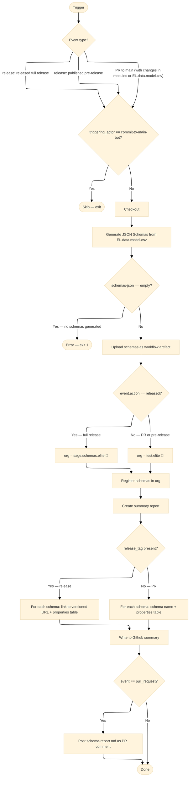

# CI/CD Documentation

- [Register Schema Workflow](#register-schema-workflow)
- [GitHub App Usage in Workflows](#github-app-usage-in-workflows)

---

## Register Schema Workflow

### Purpose
The `register-schema` workflow generates JSON schemas from the EL data model CSV, registers them in a Synapse organization, and posts a markdown summary report as a PR comment or workflow summary.

This workflow handles schema registration across two Synapse organizations:
- **Test org** (`test.elite`): used during active development and pre-release validation
- **Production org** (`sage.schemas.elite`): used for official versioned releases

### Triggers
| Event | Condition | Target Org |
|-------|-----------|------------|
| Pull request opened, synchronized, or labeled | Targets `main`; changes in `modules/**` or `EL.data.model.csv` | `test.elite` |
| Release published (pre-release) | `release.published` | `test.elite` |
| Release released (full release or pre-release promoted) | `release.released` | `sage.schemas.elite` |

> **Note:** The workflow is skipped if triggered by `commit-to-main-bot-adkp[bot]`.

### Steps
1. **Generate JSON Schemas** — converts `EL.data.model.csv` into JSON schema files using [`generate-jsonschema`](https://github.com/Sage-Bionetworks-Actions/generate-jsonschema)
2. **Check schemas were generated** — exits with an error if no schemas were produced
3. **Upload schemas as artifacts** — saves generated `.json` schemas as a downloadable workflow artifact
4. **Resolve schema organization** — selects `test.elite` or `sage.schemas.elite` based on the trigger event action
5. **Register schemas in Synapse** — registers schemas in the resolved org via [`register-jsonschema`](https://github.com/Sage-Bionetworks-Actions/register-jsonschema); uses the release tag as the semantic version when available
6. **Format Schema Report** — builds a markdown summary listing all generated schemas and their properties; includes Synapse links when a release tag is present
7. **Comment PR with Schema Summary** — posts the report as a PR comment (pull request events only); also writes the report to the workflow run summary

### Synapse Organizations
| Org Name | Purpose |
|----------|---------|
| `test.elite` | Staging: used for PR previews and pre-release validation |
| `sage.schemas.elite` | Production: used for official versioned releases |

### Release Guide

The recommended release process uses a two-step GitHub release flow to validate schemas in the test org before promoting to production.

#### Step 1 — Publish a Pre-release (registers to `test.elite`)
1. Go to **Releases → Draft a new release** in GitHub.
2. Create a new tag (e.g., `v1.2.0`) targeting `main`.
3. Check **"Set as a pre-release"**.
4. Click **Publish release** — this triggers `release.published` and registers schemas to `test.elite`.
5. Inspect the workflow summary or PR comment for the schema report.
6. Verify schemas appear in `test.elite` on Synapse.

#### Step 2 — Promote to Full Release (registers to `sage.schemas.elite`)
1. Once validated, return to the pre-release on GitHub.
2. Edit the release and uncheck **"Set as a pre-release"** (or click **"Promote to full release"**).
3. Click **Update release** — this triggers `release.released` and registers schemas to `sage.schemas.elite`.
4. Verify schemas appear in `sage.schemas.elite` on Synapse with the correct semantic version.

> **Note:**
> - Only the `release.released` action writes to the production org. Accidental pre-release publishes will only affect `test.elite`.
> - Editing the existing pre-release (not creating a new tag) is what triggers the `released` event and routes schemas to production. This triggers the workflow again and registers schemas to the production org.
> - Do not create a new tag for promotion — editing the existing pre-release is sufficient.
>
> **Release tag format requirements (enforced by Synapse):**
> - Format: `X.Y.Z` — digits only (e.g. `1.2.0` or `v1.2.0`)
> - Must be greater than `0.0.0`
> - No pre-release suffixes — tags like `v1.0.0-rc1`, `v1.0.0-beta`, or `v1.0.0-alpha` will cause schema registration to fail

### Required Secrets
| Secret | Description |
|--------|-------------|
| `SYNAPSE_TOKEN_DPE` | Synapse Personal Access Token with permissions to register schemas in both orgs |

### Outputs
- JSON schema artifacts uploaded per workflow run
- Schemas registered in the resolved Synapse organization (versioned when triggered by a release)
- Markdown summary report posted as a PR comment (PR events) and written to the workflow run summary (all events)

### Diagrams

Mermaid diagram for register-schema workflow

---

## GitHub App Usage in Workflows

### Commit to Main Bot
These workflows use the `Commit to Main Bot` app to commit changes directly to the `main` branch of the repository. The app has been given an exception to bypass the branch protections present on that branch.

### Permissions
This app has been granted `read and write` access to the contents of the repository and `read-only` access to the metadata of the repository (which is the default for GitHub apps and mandatory). All other Organization, Account, and Optional features have not been granted or left as default. Copilot integration has not been enabled.

### Authentication
The private key for this app that is used in this repository was generated on 02/19/2025 and can be accessed in workflows through the `COMMIT_BOT_KEY` repository secret. The app ID is also stored as a Repository variable under `COMMIT_BOT_ID`.

### Used In

- update_metadata_dictionary.yml
